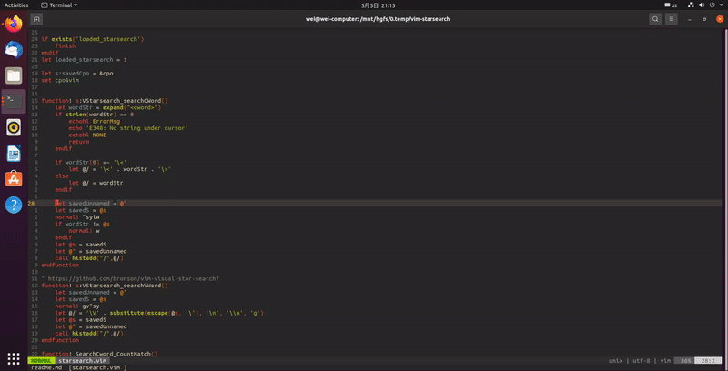

# readme.md

The plug provides two search modes with the * key.

normal mode:
Change the behavior of the super star(*) key. Vim don't jump to the next match when * is pressed. Also add the word to search history and count match.

visual mode:
Add * key support for visual mode. You can select some text (using visual mode) and then press * for searching (don't jump to the next match). Also add the word to search history and count match.

thanks:https://www.vim.org/scripts/script.php?script_id=4335
